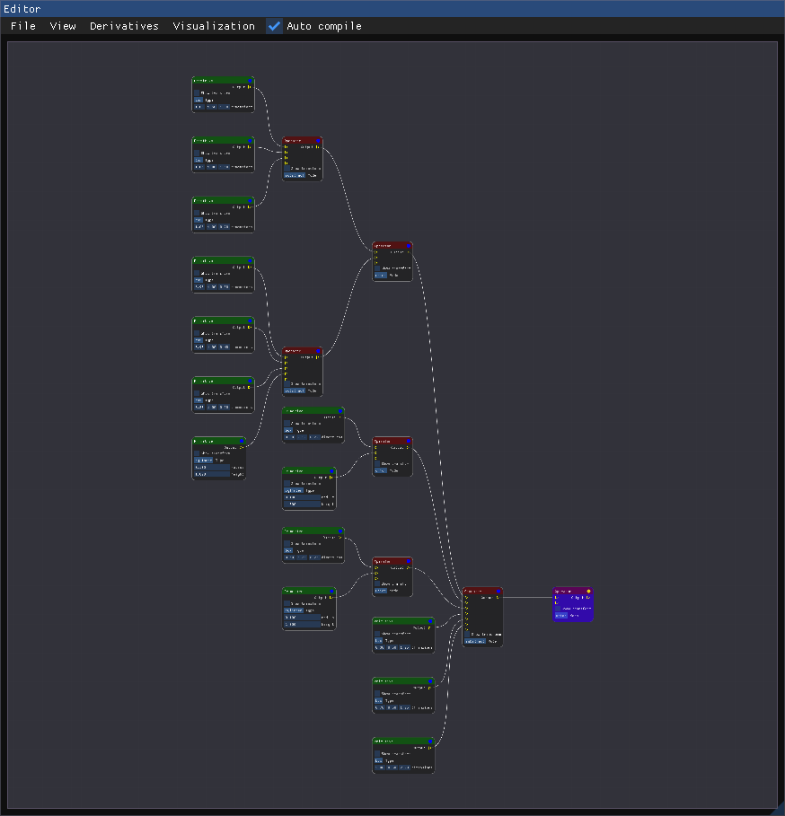
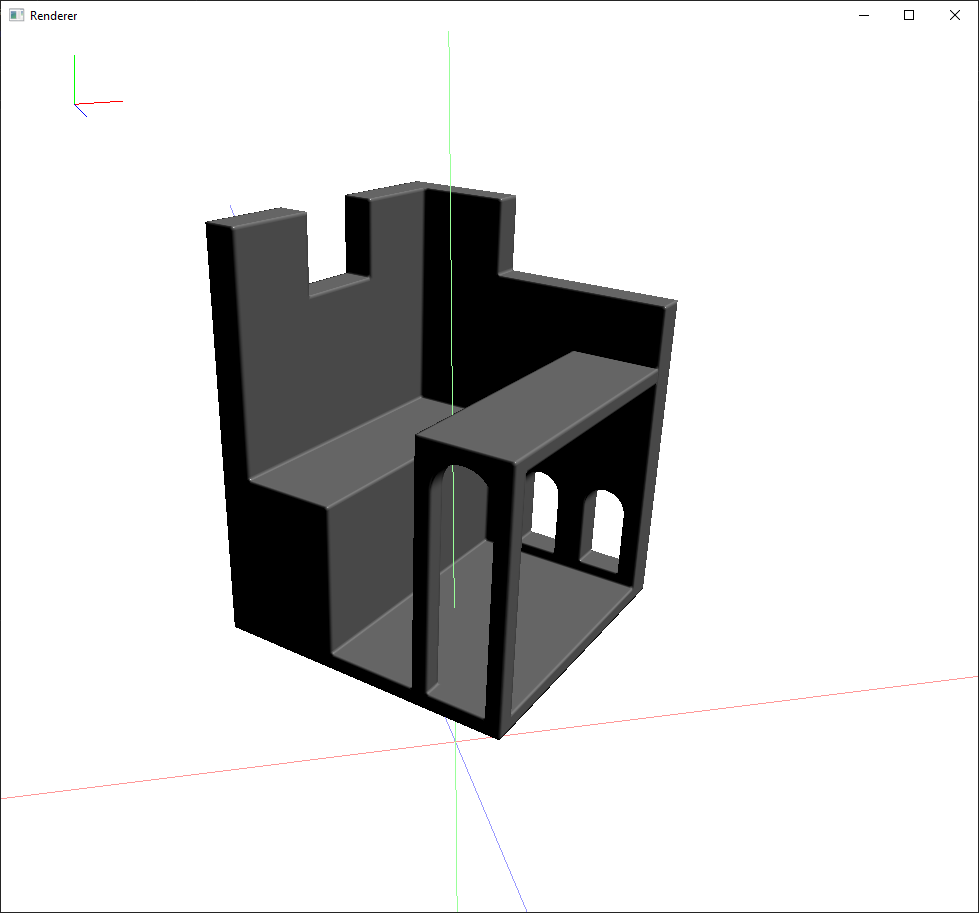
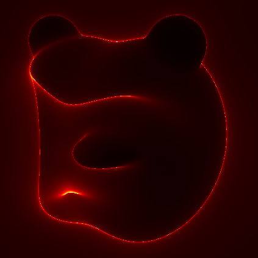
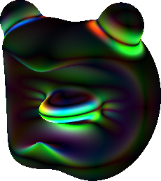
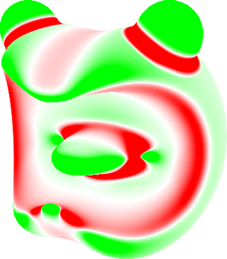
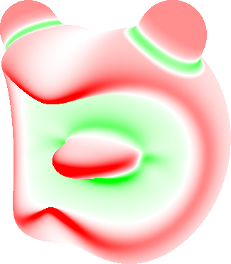

# CSG gráfszerkesztő, távolságfüggvény automatikus differenciálásával
CSG Gráf alapú modellezőprogram, távolságfüggvények és deriváltjaik generálására. 
A deriváltak kiszámítása GPU-n történik, automatikus differenciálással. Az ehhez szükséges shader kódot a program generálja, alapesetben minden változtatást követően.

## Fordítás
Visual Studio-val különösebb beállítások nélkül. Ismert probléma lehet, hogy a felhasznált Dragonfly könyvtár nem fordul egyes MSVC verziókkal. Egy biztosan működő MSVC verzió: **14.30.30705**

## Rövid használati útmutató
A program alapvetően két ablakból áll, egy gráfszerkesztőből (editor) és egy kirajzolóból (renderer).
A szerkesztőben üres területve jobbklikkelve lehet új csúcsokat létrehozni. Ezek összekötésével és tulajdonságaik állításával hozható létre a modellt leíró CSG gráf.

Alapesetben a program minden módosítást követően újragenerálja a megjelenítéshez használt távolságfüggvényt, így a másik ablakban nyomon követhetőek a változtatások. Ha aa shader fordítás túl lassú lenne, ez a funkció a szerkesztő ablak "Auto compile" opciójával kikapcsolható.

A megejelenített részfa gyökerét lila háttérszín jelzi, valamint egy sárga pötty a jobb felső sarokban. Más csúcsokon ugyanide kattintva kiválasztható a megjelenítendő részfa gyökere.

  
   

### Automatikus differenciálás

A szerkesztő ablak menüsávjában a "Derivatives" menüpont segítségével bekapcsolható, hogy a távolságfüggvény deriváltjait automatikus differenciálással előállító shader kód generálva legyen-e, illetve hanyadrendű derviáltakat legyen képes meghatározni. A teljesítményre és a shaderfordítás sebességére ez az opció van a legnagyobb hatással.

### Megjelenítési lehetőségek

A szerkesztőablak "Visualization" menüpontjából számos beállítás elérhető. 
Kiválasztható, hogy a megjelenítés teljesen valósidejű legyen-e, vagy csak akkor rajzolódjon egy képkocka újra, ha a modell vagy a nézőpont változott.

Ezen kívül beállítható a deriváltak differenciahányadossal történő közelítésekor használt epszilon érték (eps). 

Ha a generált shader rendelkezik az automatikus differenciáláshoz szükséges duális távolságfüggvénnyel, akkor kiválasztható, hogy a kirajzolásnál ez legyen használva a differenciahányadosok helyett. (ez az előző pont szerint kapcsolható be)

Vizualizálási módokból az alábbiak érhetőek el:
- phong árnyalás
- normálvektorok szerinti rgb színezés
- sphere tracing lépésszámának megjelenítése
- differenciahányadosos és automatikusan derivált normálvektorok különbségének megjelenítése
- Gauss-görbület
- Közép-görbület

  
  
  
  
  
  

## 3D megjelenítő
- Mozgás: WASD
- Kamera forgatása: bal egérgomb + egér mozgatás
- Fényforrás iránya legyen a kamera iránya: space

## Dokumentáció
A TDK dolgozat anyagából később szakdolgozatot is készítettem, mely a kód fejlesztői és felhasználó dokumentációját is tartalmazza. Ez a dokumentáció elérhető [itt](docs.pdf).