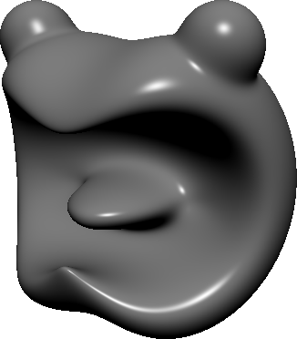
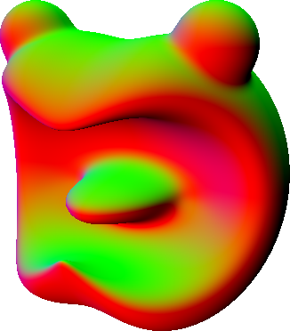

# CSG graph editor with the automatic differentiation of the SDF
This is a CSG[^1] graph editor that generates signed distance functions (SDFs) for the created surfaces. It also generates shader code for performing automatic differentation of the SDF on the GPU.

## Building the editor
Open the provided solution file with Visual Studio. Building the project does not require any extra settings, other than having the C++ module of VS installed. There is a known problem that the included [Dragonfly](https://github.com/ELTE-IK-CG/Dragonfly) library does not compile with some MSVC versions. A tested working MSVC version:  **14.30.30705**

## Short user guide
The program opens in two windows (and a debug console), a graph editor and a renderer for displaying the surface represented by the graph.
New nodes can be added by opening the context menu of the editor by right clicking an empty spot. The CSG graph can be constructed by connecting these nodes with the mouse and editing their settings.

By default the SDF used for rendering will be regenerated after each change, so their effect can be observed in the other window in real-time. For more complex scenes shader compilation may become slow, in that case turn off autocompilation by unticking the "Auto compile" checkbox in the editor.

The root of the currently rendered subtree is displayed with a purple node background and a yellow spot in its top right corner. The displayed subtree can be changed by clicking the top right corner of the desired root node. 

  
   

### Automatic differentiation

This can be turned on under the "Derivatives" option in the editor. If enabled, the generated shader code will include a dual SDF for performing automatic differentiation. In case it is disabled, the required derivatives can be approximated with symmetric finite differences. There is an option for selecting the order of differentiation, all partial derivatives will be computed up to the selected order. This is the setting that affects performance the most. In theory the program is capable of generating derivatives of arbitrary order, but in practice the generated shaders become so complex that third order and above is infeasible due to the driver refusing compilation.

### Visualization options

These settings are accessible in the editor under the option with the same name.
One may select rendering to be completely real-time or only occur when there is either a change of the graph or the camera.

You may also select the epsilon for approximating derivatives with finite differences whenever automatic differentiation is disabled.

If the generated shader includes a dual SDF, you can select whether to use automatic differentiation or finite differences for the derivatives.

The following visualization modes are available:
- Phong shading
- Coloring by normals
- Stepcount of sphere tracing
- Difference of gradients (normals) calculated by automatic differentiation and finite differences.
- Gaussian curvature
- Mean curvature

  
  
  
  
  
  

## 3D renderer
- Movement: WASD
- Camera rotation: left mouse button + mouse movement
- Change light direction to the viewing direction: space

## Documentation (hungarian only)
My thesis contains the user and developer documentation of the software as well as my TDK[^2] paper containing measurement results and mathematical explanations. It is available [here](docs.pdf).

[^1]: **C**onstructive **S**olid **G**eometry
[^2]: "**T**udományos **D**iákköri **K**onferencia" is a hungarian national conference and competition for student researchers.

# CSG gráfszerkesztő, távolságfüggvény automatikus differenciálásával
CSG Gráf alapú modellezőprogram, távolságfüggvények és deriváltjaik generálására. 
A deriváltak kiszámítása GPU-n történik, automatikus differenciálással. Az ehhez szükséges shader kódot a program generálja, alapesetben minden változtatást követően.

## Fordítás
Visual Studio-val különösebb beállítások nélkül. Ismert probléma, hogy a felhasznált Dragonfly könyvtár nem fordul egyes MSVC verziókkal. Egy biztosan működő MSVC verzió: **14.30.30705**

## Rövid használati útmutató
A program alapvetően két ablakból áll, egy gráfszerkesztőből (editor) és egy kirajzolóból (renderer).
A szerkesztőben üres területre jobbklikkelve lehet új csúcsokat létrehozni. Ezek összekötésével és tulajdonságaik állításával hozható létre a modellt leíró CSG gráf.

Alapesetben a program minden módosítást követően újragenerálja a megjelenítéshez használt távolságfüggvényt, így a másik ablakban nyomon követhetőek a változtatások. Ha a shader fordítás túl lassú lenne, ez a funkció a szerkesztő ablak "Auto compile" opciójával kikapcsolható.

A megejelenített részfa gyökerét lila háttérszín jelzi, valamint egy sárga pötty a jobb felső sarokban. Más csúcsokon ugyanide kattintva kiválasztható a megjelenítendő részfa gyökere.

  
   

### Automatikus differenciálás

A szerkesztő ablak menüsávjában a "Derivatives" menüpont segítségével bekapcsolható, hogy a távolságfüggvény deriváltjait automatikus differenciálással előállító shader kód generálva legyen-e, illetve hanyadrendű deriváltakat legyen képes meghatározni. A teljesítményre és a shaderfordítás sebességére ez az opció van a legnagyobb hatással.

### Megjelenítési lehetőségek

A szerkesztőablak "Visualization" menüpontjából számos beállítás elérhető. 
Kiválasztható, hogy a megjelenítés teljesen valósidejű legyen-e, vagy csak akkor rajzolódjon egy képkocka újra, ha a modell vagy a nézőpont változott.

Ezen kívül beállítható a deriváltak differenciahányadossal történő közelítésekor használt epszilon érték (eps). 

Ha a generált shader rendelkezik az automatikus differenciáláshoz szükséges duális távolságfüggvénnyel, akkor kiválasztható, hogy a kirajzolásnál ez legyen használva a differenciahányadosok helyett. (ez az előző pont szerint kapcsolható be)

Vizualizálási módokból az alábbiak érhetőek el:
- phong árnyalás
- normálvektorok szerinti rgb színezés
- sphere tracing lépésszámának megjelenítése
- differenciahányadosos és automatikusan derivált normálvektorok különbségének megjelenítése
- Gauss-görbület
- Közép-görbület

  
  
  
  
  
  

## 3D megjelenítő
- Mozgás: WASD
- Kamera forgatása: bal egérgomb + egér mozgatás
- Fényforrás iránya legyen a kamera iránya: space

## Dokumentáció
A TDK dolgozat anyagából később szakdolgozatot is készítettem, mely a kód fejlesztői és felhasználó dokumentációját is tartalmazza. Ez a dokumentáció elérhető [itt](docs.pdf).
